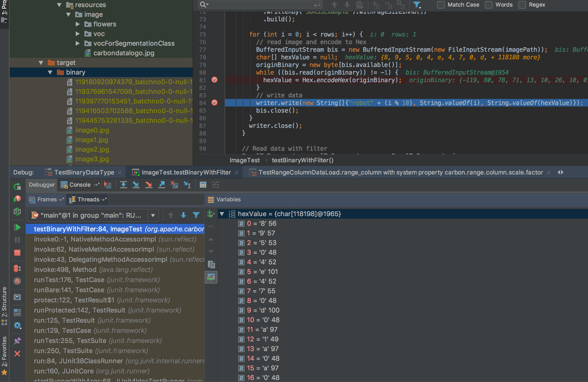

Hive support binary data type

## environment
Hadoop-2.7.7
Hive-1.2.2
no hive-site.xml

## Running
	./bin/hive
### history
	hive> Create table image(picture binary);
	OK
	Time taken: 0.357 seconds
	hive> load data local inpath '/tmp/photo.jpg' into table image; 
	FAILED: SemanticException Line 1:23 Invalid path ''/tmp/photo.jpg'': No files matching path file:/tmp/photo.jpg
	hive> load data local inpath '/Users/xubo/Desktop/xubo/git/carbondata3/store/sdk/src/test/resources/image/carbondatalogo.jpg' into table image; 
	Loading data to table default.image
	Table default.image stats: [numFiles=1, totalSize=59099]
	OK
	Time taken: 0.209 seconds
	hive> 
	    > 
	    > select * from image;
	OK
	�PNG
	
	
	IHDR
	�}�ذPD��>D��HA�:I.HBz����o���r\#`
	�_��ovvvvfg��
	             +++
	                �C3�9��8P��n.���HhV�f9h���@���h.���J�,���hV����7s�Y	�e��;��J�����4+�����K�5S�k��K�e��˿�z��Z�^k�쵢��꯲�<��k�o�l��S�;��LגNU��������y\J�93k��L��"9�Z�քi�og4+�vbx-%��5S2���L�XX�S
	                                                                                                                                                                                                ,�LڛkWy9�VP\��kEE���L�-�ܕ5�)�k^Jsd[s�Y	�5�_���{ex͇:/4%י�X�Ze0k!�f��O��V	��@"o�_�ւl~��hV�m��*�����}�hNMͬ
	                                                                                                      V���kM� �k�a��#��$�ע'Ǔ4G���p���5��T�M���U�-���
	����^�t�ҕ+W�]�vݺu�n��`�6m�R�'/�u��mڴiժU�v�ڶmۮ}����w�ҥs��RZ�lYT�Ƣy�5U7���mρ۾���8��
	V�:Q�_y��˗�Z�jQ֯�(�l�2�H!s&��A�rT��g�Y��;v�ڕ*�6��ի[�nݻu�ؽ{w�*����E5G��-�vb�b��P��p��
	                                                                                   ���K
	                                                                                       ^z��,�~�fUiWQQ�ĉ��W"��

	***
####Hex code

	hive> select hex(*) from image;
	OK
	89504E47
	1A
	000000
	494844520000
	D87D88D8B05044B0A03E0544AA84044802418A123A492E1D48427ACFE5EEDE6FBFB9FB725C2360
	07B71C5FF6DB6F767676766667B6FE0B2B2B2B0B9A4333079A39B0E33850B4E38A6E2EB99903CD1C481C6856C2663968E6C00EE640B312EEE006682EBE9903CD4AD82C03CD1CD8C11C6856C21DDC00CDC53773A059099B65A099033B9803CD4AB8831BA0B9F8660E342BE1F69381BA4BB23553C46BBDD64B9965DDF8CBBFD67A8DF45A895E6B86ECB5A2A0A0EAAFB2B23C8FD7046B8E6F1F0E14D66CF8ED53E43BBC944CD7924E141555F580D104858585C119AF795C4AE3AF39336B81D54CCFE32239E65A85D684698E6F670E342BE17662782D25A9AB03355332E0D71AAF4C1BD15A58589C530C2C834CDA9B6B577939B356505CBC19CC6B454505808091054C8B162DB2DC9535FB0229F96B5E4A73645B73A05909B735875F839F947B0F6578CD873A2F3425D799F858FD5A65306B21A166F5EA4F8EA756091515898C40226FA85FBCD6826C7EDDD61C6856C26DCDE12AFCA4BC9688137DDF684E4DCDAC0B5693BEFC6B4DCB0620D26BE261EB149723AF89248FD7A227C793033447B60F079A9570FBF0F935A5D454A14DE595C5C555C62D80E8E686
	1BCACACA56AF5EBD74E9D2952B57AE5DBB76DDBA759E1B376EF4A4609B366DCA15522E08E99B272FB475EBD66DDAB469D5AA55BB76EDDAB66DDBAE7D9BF6EDDB77E9D2A573E7CE525AB66C595498C6A27991355537F0BC86D6E6976DCF8116DBBE88E612AA3890AB
	131456883A511B2EEA8A152B5F79E595E5CB97AF5AB56A5116D6AFDF28BE6CD932AA4821732686B24115D8725400A890678E5904B0E48E1D3B76EDDA952A8636F6EAD5AB5BB76EDDBB7591D8BD7B77EA2A17AD069CC1E7453547B613079A2DE17662B462C2CE501EAAB570E1C2050B16BCF4D24B0B5E7AE5D52CB07E99665569575151D5C4898CA157
	
####Java:

### Carbon Java SDK

    byte[] outputBinary = (byte[]) row[1];
      System.out.println(row[0] + " " + row[2] + " image size:" + outputBinary.length);

      // validate output binary data and origin binary data
      assert (originBinary.length == outputBinary.length);
      for (int j = 0; j < originBinary.length; j++) {
        assert (originBinary[j] == outputBinary[j]);
      }
      String value = new String(outputBinary);
      System.out.println(value);
      // save image, user can compare the save image and original image
      String destString = "./target/binary/image" + i + ".jpg";
####Result: 
```	   
	      Data:
	2019-04-15 17:02:00 INFO  ResultCollectorFactory:68 - Vector based dictionary collector is used to scan and collect the data
	robot0 0 image size:59099
	
		�PNG
		
		IHDR
		...
		[<�Su��}{��YRR��.�<�[�tR]����oZ3%G�{�5�|�	4+��KB.:�l�<yb��E�ZgV�Z3{�����瞣~k׮����L%5~}
		�"��&�H��5a�"�PH�P�T����;m���:p����E...
```

### Carbon python SDK：

    while (reader.hasNext()):
        rows = reader.readNextBatchRow()
        for row in rows:
            i = i + 1
            if 0 == i % 1000:
                print(i)
            print(row[1].tostring())
            for column in row:
                column

    print(i)
###Result		
	b'\x89PNG\r\n\x1a\n\x00\x00\x00\rIHDR\x00\x00\x01,\x00\x00\x01,\x08\x02\x00\x00\x00\xf6\x1f\x19"\x00\x00\x00\x01sRGB\x00\xae\xce\x1c\xe9\x00\x00\x00 cHRM\x00\x00z&\x00\x00\x80\x84\x00\x

####TODO for Carbon:
	
	val result = sql(s"SELECT hex(*) FROM carbon.`$Path`")
	
	Invalid number of arguments for function hex. Expected: 1; Found: 3; line 1 pos 7
	org.apache.spark.sql.AnalysisException: Invalid number of arguments for function hex. Expecte
	
###base64:

	 > select base64(*) from image;
	OK
	iVBORw==
	Gg==
	AAAA
	SUhEUgAA
	2H2I2LBQRLCgPgVEqoQESAJBihI6SS4dSEJ6z+Xu3m+/uftyXCNg
	B7ccX/bbb3Z2dnZmZ7b+CysrKwuaQzMHmjmw4zhQtOOKbi65mQPNHEgcaFbCZjlo5sAO5kCzEu7gBmguvpkDzUrYLAPNHNjBHGhWwh3cAM3FN3OgWQmbZaCZAzuYA81KuIMboLn4Zg40K+H2k4G6S7I1U8RrvdZLmWXd+Mu/1nqN9FqJXmuG7LWioKDqr7KyPI/XBGuObx8OFNZs+O1T5Du8lEzXkk4UFVX1gNEEhYWFwRmveVxK4685M2uB1UzP4yI55lqF1oRpjm9nDjQr4XZieC0lqasDNVMy4Ncar0wb0VpYWJxTDCyDTNqba1d5ObNWUFy8GcxrRUUFgICRBUyLFi2y3JU1+wIp+WteSnNkW3OgWQm3NYdfg5+Uew9leM2HOi80JdeZ+Fj9WmUwayGhZvXqT46nVgkVFYmMQCJvqF+81oJsft3WHGhWwm3N4Sr8pLyWiBN932hOTc2sC1aTvvxrTcsGINJr4mHrFJcjr4kkj9eiJ8eTAzRHtg8HmpVw+/D5NaXUVKFN5ZXFxVXGLYDo5oY=
	G8rKylavXr106dKVK1euXbt23bp1nhs3bvSkYJs2bcoVUi4I6ZsnL7R169Zt2rRp1apVu3bt2rZt2659m/bt23fp0qVz585SWrZsWVSYxqJ5kTVVN/C8htbml23PgRbbvojmEqo4kKs=
	ExRWiDpRGy7qihUrX3nlleXLl69atWpRFtav3yi+bNkyqkghcyaGskEV2HJUAKiQZ45ZBLDkjh07du3alSqGNvbq1atbt27du3WR2L17d+oqF60GnMHnRTVHthMHmi3hdmK0YsLOUB6qtXDhwgULFrz00ksLXnrl1SywfplmVWlXUVHVxImMoVcivoU=
	C93LXl8zffpayJSxoiLN00TIv3qtKC9jMJnHHj169O7de8CA
	
	Wzz9Uxd1//59e/bsWVJSsssuuwwePJgbW7V0Ul3H0PyobxRaMyVHmHu2Nb8GfA7THAkONCvh60tCLjr5bIc8eWLkz0WtWmcLVq1aM3v27Oeff/65556jfmvXrg+V438GnsxMJTV+fQ==
	tgwip6EmzkjMEeSvNWHyryIVFZtQSIVQy1SykLvvvjttHLHn8A4dOhhw5sC5mkU=
	zAK0QkSk55E8V3OkLgealbAuT2qn1NS9+Ea2RELaxNk0T0JJfF94sfTFF1/817/+VVpaalAnxYocgQ7gGHRBKLt4JNYu782+51RBgJhAEyXmKAPGq6LzxJoRSxpolgJSgAdkIrWgYMiQIRRy+PDhO++8c8eO7Wvmet144Gmo0NfN/vYGaFbC12lf+kOLAijkMsQ6t3g+MXoU75///KfnggUvEzVy7EnyBAAyeoYIeg==
	kRJot8oTwsAcxeWvQUBe+uuWhbSM6qR7tWph
	R/chmGulh/vvvz+F7NunF5xqqcR8mtcrPDDUKg7mWp1CLYB35uvWl4a3JR9JXkhPCFZ6LS5eunQ5rXvkkUeefvppCwk+SW/Vqg==
	vc11ADfEhWRMMrXM4yJbkVeBFsLQOmUJ
#### Carbon
 	  sql("SELECT base64(*) FROM binaryCarbon3").show()
#####Don't support now
	Invalid number of arguments for function base64. Expected: 1; Found: 5; line 1 pos 7
	org.apache.spark.sql.AnalysisException: Invalid number of arguments for function base64. Expected: 1; Found: 5; line 1 pos 7
		at org.apache.spark.sql.catalyst.analysis.FunctionRegistry$$anonfun$7$$anonfun$11.apply(FunctionRegistry.scala:538)
		at org.apache.spark.sql.catalyst.analysis.FunctionRegistry$$anonfun$7$$anonfun$11.apply(FunctionRegistry.scala:528)
		at scala.Option.getOrElse(Option.scala:121)
		
## Storage:

	hive> load data local inpath '/Users/xubo/Desktop/xubo/git/carbondata3/store/sdk/src/test/resources/image/carbondatalogo.jpg' into table image; 
	Loading data to table default.image
	Table default.image stats: ÄnumFiles=2, totalSize=118198Å
	OK
	Time taken: 0.144 seconds
	hive> 
        
        
###Result:
	localhost:apache-hive-3.1.1-bin xubo$ ll /user/hive/warehouse/image/
	total 240
	-rwxrwxrwx  1 xubo  wheel    58K Apr 15 16:25 carbondatalogo_copy_1.jpg
	-rwxrwxrwx  1 xubo  wheel    58K Apr 15 16:02 carbondatalogo.jpg
	localhost:apache-hive-3.1.1-bin xubo$ ll /user/hive/warehouse/image/

### disk

	hive> create table xubo3(name String, age int, image binary);
	FAILED: Execution Error, return code 1 from org.apache.hadoop.hive.ql.exec.DDLTask. AlreadyExistsException(message:Table xubo3 already exists)
	hive> create table xubo4(name String, age int, image binary);
	OK
	Time taken: 0.063 seconds
	hive> insert into xubo2 values('Bob',29,'sdasda');
	FAILED: SemanticException ÄError 10044Å: Line 1:12 Cannot insert into target table because column number/types are different 'xubo2': Table insclause-0 has 2 columns, but query has 3 columns.
	hive> insert into xubo4 values('Bob',29,'sdasda');
	
	hive> 
	    > select base64(image) from xubo4;
	OK
	c2Rhc2Rh
	Time taken: 0.084 seconds, Fetched: 1 row(s)
	
	hive> select image from xubo4;
OK
sdasda

#### disk:

	localhost:xubo4 xubo$ ll .
	total 8
	-rwxrwxrwx  1 xubo  wheel    16B Apr 15 17:42 000000_0
	localhost:xubo4 xubo$ vi 000000_0 
	
	Bob^A29^Ac2Rhc2Rh
	
So hive storage data as base 64 format in disk 
## Count:

	hive> load data local inpath '/Users/xubo/Desktop/xubo/git/carbondata3/store/sdk/src/test/resources/image/carbondatalogo.jpg' into table image; 
	Loading data to table default.image
	Table default.image stats: ÄnumFiles=1, totalSize=59099Å
	OK
	Time taken: 0.123 seconds
	hive> select count(*) from image;
	Query ID = xubo_20190415163156_0375c5e0-15b0-4f8a-8dfb-9cec95698a6d
	Total jobs = 1
	Launching Job 1 out of 1
	Number of reduce tasks determined at compile time: 1
	In order to change the average load for a reducer (in bytes):
	  set hive.exec.reducers.bytes.per.reducer=<number>
	In order to limit the maximum number of reducers:
	  set hive.exec.reducers.max=<number>
	In order to set a constant number of reducers:
	  set mapreduce.job.reduces=<number>
	Job running in-process (local Hadoop)
	2019-04-15 16:31:58,099 Stage-1 map = 100%,  reduce = 100%
	Ended Job = job_local2036345690_0006
	MapReduce Jobs Launched: 
	Stage-Stage-1:  HDFS Read: 0 HDFS Write: 0 SUCCESS
	Total MapReduce CPU Time Spent: 0 msec
	OK
	410
	Time taken: 1.653 seconds, Fetched: 1 row(s)
	hive> 
###Why count is 410 for one image?

##Case 2: multiple columns
	
	 hive> 
	 create table over10k_n20(
	                t tinyint,
	                si smallint,
	                i int,
	                b bigint,
	                f float,
	                d double,
	                bo boolean,s string, ts timestamp, édecé decimal(4,2),  bin binary) row format delimited fields terminated by 'ö';
	OK
	Time taken: 0.058 seconds
	hive>  show tables;
	OK
	binarytable
	hive
	image
	over10k_n20
	xubo
	xubo3
	Time taken: 0.039 seconds, Fetched: 6 row(s)
	hive> select * from over10k_n20;
	OK
	Time taken: 0.086 seconds
	hive> load data local inpath '/Users/xubo/Desktop/xubo/git/hive/data/files/over1k' into table over10k_n20;
	Loading data to table default.over10k_n20
	Table default.over10k_n20 stats: ÄnumFiles=1, totalSize=106636Å
	OK
	Time taken: 0.127 seconds
	hive> select * from over10k_n20;
	OK
	124	336	65664	4294967435	74.72	42.47	true	bob davidson	2013-03-01 09:11:58.703302	45.4	yard duty
	19	442	65553	4294967380	26.43	37.77	true	alice zipper	2013-03-01 09:11:58.703217	29.62	history
	35	387	65619	4294967459	96.91	18.86	false	katie davidson	2013-03-01 09:11:58.703079	27.32	history
	111	372	65656	4294967312	13.01	34.95	false	xavier quirinius	2013-03-01 09:11:58.70331	23.91	topology
	54	317	65547	4294967409	60.71	2.09	false	nick robinson	2013-03-01 09:11:58.703103	90.21	geology
	-3	467	65575	4294967437	81.64	23.53	true	tom hernandez	2013-03-01 09:11:58.703188	32.85	study skills
	53	317	65702	4294967398	35.17	30.87	false	ulysses hernandez	2013-03-01 09:11:58.703164	79.5	industrial engineering
	122	356	65759	4294967379	92.61	18.82	true	priscilla ichabod	2013-03-01 09:11:58.703175	92.81	nap time
	18	407	65725	4294967362	82.52	5.3	true	quinn van buren	2013-03-01 09:11:58.703282	35.86	kindergarten
### Data

	124|336|65664|4294967435|74.72|42.47|true|bob davidson|2013-03-01 09:11:58.703302|45.40|yard duty
	19|442|65553|4294967380|26.43|37.77|true|alice zipper|2013-03-01 09:11:58.703217|29.62|history
	35|387|65619|4294967459|96.91|18.86|false|katie davidson|2013-03-01 09:11:58.703079|27.32|history
	111|372|65656|4294967312|13.01|34.95|false|xavier quirinius|2013-03-01 09:11:58.703310|23.91|topology
	54|317|65547|4294967409|60.71|2.09|false|nick robinson|2013-03-01 09:11:58.703103|90.21|geology
	-3|467|65575|4294967437|81.64|23.53|true|tom hernandez|2013-03-01 09:11:58.703188|32.85|study skills
	53|317|65702|4294967398|35.17|30.87|false|ulysses hernandez|2013-03-01 09:11:58.703164|79.50|industrial engineering
	122|356|65759|4294967379|92.61|18.82|true|priscilla ichabod|2013-03-01 09:11:58.703175|92.81|nap time
	18|407|65725|4294967362|82.52|5.30|true|quinn van buren|2013-03-01 09:11:58.703282|35.86|kindergarten
	66|484|65685|4294967387|45.99|6.81|false|luke laertes|2013-03-01 09:11:58.703317|63.27|mathematics
	122|444|65675|4294967500|72.62|34.15|false|xavier polk|2013-03-01 09:11:58.703222|99.79|american history
	115|269|65627|4294967362|91.42|1.61|false|zach falkner|2013-03-01 09:11:58.703252|49.85|american history
	...
	
###Cast

	hive> select CAST(b AS BINARY) from over10k_n20;
	FAILED: SemanticException Line 0:-1 Wrong arguments 'b': Only string, char, varchar or binary data can be cast into binary data types.
	hive> 

For String

	 > select CAST(s AS BINARY) from over10k_n20;
	OK
	bob davidson
	alice zipper
	katie davidson
	xavier quirinius
	nick robinson
	tom hernandez
	ulysses hernandez
	priscilla ichabod
	quinn van buren
	luke laertes
	xavier polk
	zach falkner
	quinn davidson
	priscilla van buren
	fred king
	calvin ellison
	sarah garcia
	zach young
	
	
	create table over10k_n20_2(t tinyint,si smallint,i int,b bigint,f float,d double,bo boolean,s string, ts timestamp, édecé decimal(4,2),  bin binary)
	

##Reference
[1] https://issues.apache.org/jira/browse/HIVE-2482
[2] https://cwiki.apache.org/confluence/display/Hive/Binary+DataType+Proposal
[3] https://www.cnblogs.com/yejibigdata/p/6380744.html