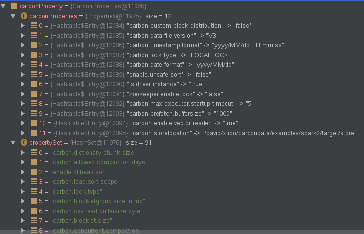
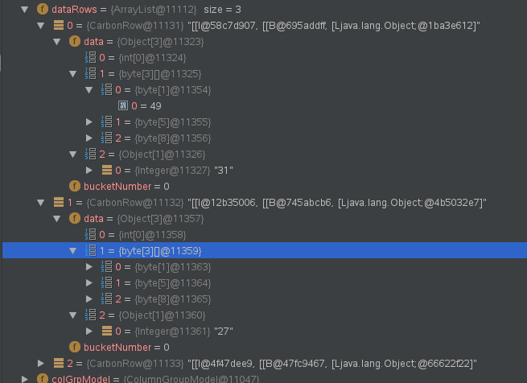
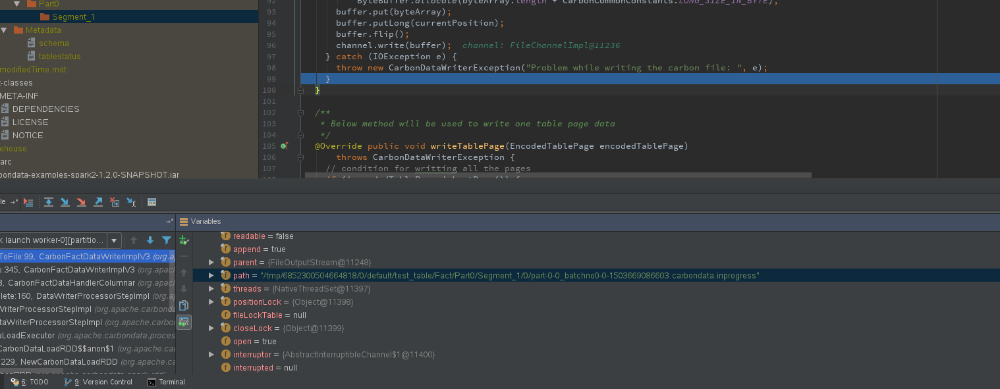
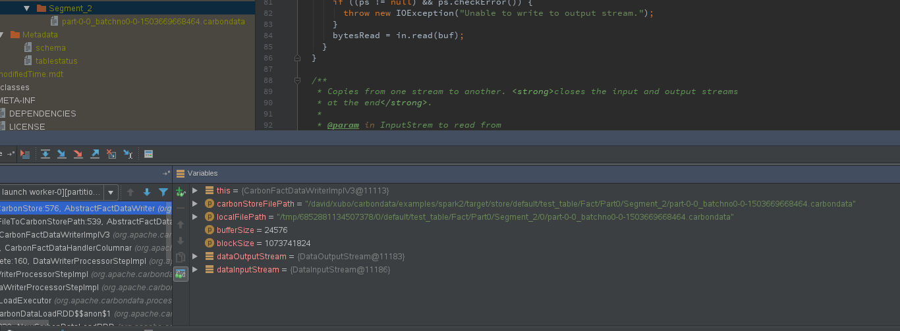

CarbonData load data的源码分析

#环境说明
	Spark-2.1.0  
	Carbon-1.2.0-SNAPSHOT  
	Scala-2.11.8  
	Java-1.8.0_131  

#运行代码
	
	package org.apache.carbondata.examples.test
	
	import java.io.File
	
	import org.apache.carbondata.core.constants.CarbonCommonConstants
	import org.apache.carbondata.core.util.CarbonProperties
	import org.apache.spark.sql.SparkSession
	
	object LoadAnalysis {
	  def main(args: Array[String]): Unit = {
	    val rootPath = new File(this.getClass.getResource("/").getPath
	      + "../../").getCanonicalPath
	    val storeLocation = s"$rootPath/target/store"
	    val warehouse = s"$rootPath/target/warehouse"
	    val metastoredb = s"$rootPath/target"
	
	    CarbonProperties.getInstance()
	      .addProperty(CarbonCommonConstants.CARBON_TIMESTAMP_FORMAT, "yyyy/MM/dd HH:mm:ss")
	      .addProperty(CarbonCommonConstants.CARBON_DATE_FORMAT, "yyyy/MM/dd")
	
	    import org.apache.spark.sql.CarbonSession._
	    val carbon = SparkSession
	      .builder()
	      .master("local")
	      .appName("CarbonSessionExample")
	      .config("spark.sql.warehouse.dir", warehouse)
	      .config("spark.driver.host", "localhost")
	      .getOrCreateCarbonSession(storeLocation, metastoredb)
	    carbon.sparkContext.setLogLevel("ERROR")
	    import carbon._
	    val path = s"$rootPath/src/main/resources/sample.csv"
	
	    carbon.sql(s"""LOAD DATA INPATH '$path' INTO TABLE test_table""")
	    carbon.sql("SELECT * FROM test_table").show()
	    sql("DELETE FROM test_table")
	    carbon.stop()
	  }
	}

# 源码分析
##1.sessionState.sqlParser.parsePlan(sqlText)
入口：
   
	org.apache.spark.sql.CarbonSession
该类继承了SparkSession，重写了部分方法

执行sql方法（org.apache.spark.sql.SparkSession#sql）：

	  def sql(sqlText: String): DataFrame = {
	    Dataset.ofRows(self, sessionState.sqlParser.parsePlan(sqlText))
	  }

其中sessionState被CarbonSession重写了。

	  override private[sql] lazy val sessionState: SessionState = new CarbonSessionState(this)

而CarbonSessionState中的sqlParser方法也被重写了，改为了CarbonSparkSqlParser：

	class CarbonSessionState(sparkSession: SparkSession) extends HiveSessionState(sparkSession) {
	
	  override lazy val sqlParser: ParserInterface = new CarbonSparkSqlParser(conf, sparkSession)

CarbonSessionState继承了HiveSessionState   
CarbonSparkSqlParser继承了AbstractSqlParser

	class CarbonSparkSqlParser(conf: SQLConf, sparkSession: SparkSession) extends AbstractSqlParser 

new CarbonSparkSqlParser的时候属性astBuilder是CarbonSqlAstBuilder的对象：

	val astBuilder = new CarbonSqlAstBuilder(conf)

而CarbonSqlAstBuilder的parser是CarbonSpark2SqlParser

	val parser = new CarbonSpark2SqlParser

CarbonSpark2SqlParser继承了抽象类CarbonDDLSqlParser：
	
	class CarbonSpark2SqlParser extends CarbonDDLSqlParser

抽象类CarbonDDLSqlParser继承了抽象类AbstractCarbonSparkSQLParser：

	abstract class CarbonDDLSqlParser extends AbstractCarbonSparkSQLParser 

CarbonSparkSqlParser的parsePlan调用了父类(org.apache.spark.sql.catalyst.parser.AbstractSqlParser#parsePlan)的parsePlan方法进行执行：

	override def parsePlan(sqlText: String): LogicalPlan = {
	    val carbonSessionInfo: CarbonSessionInfo = CarbonEnv.getInstance(sparkSession).carbonSessionInfo
	    ThreadLocalSessionInfo.setCarbonSessionInfo(carbonSessionInfo)
	    try {
	      super.parsePlan(sqlText)
	    } catch {
        ...

AbstractSqlParser#parsePlan方法为：

	  /** Creates LogicalPlan for a given SQL string. */
	  override def parsePlan(sqlText: String): LogicalPlan = parse(sqlText) { parser =>
	    astBuilder.visitSingleStatement(parser.singleStatement()) match {
	      case plan: LogicalPlan => plan
	      case _ =>
	        val position = Origin(None, None)
	        throw new ParseException(Option(sqlText), "Unsupported SQL statement", position, position)
	    }
	  }

其中parse方法是org.apache.spark.sql.parser.CarbonSparkSqlParser#parse的，调用的是父类的parse，

	protected override def parse[T](command: String)(toResult: SqlBaseParser => T): T = {
	    super.parse(substitutor.substitute(command))(toResult)
	  }

即org.apache.spark.sql.catalyst.parser.AbstractSqlParser#parse：

	 protected def parse[T](command: String)(toResult: SqlBaseParser => T): T = {
	    logInfo(s"Parsing command: $command")
	
	    val lexer = new SqlBaseLexer(new ANTLRNoCaseStringStream(command))
	    lexer.removeErrorListeners()
	    lexer.addErrorListener(ParseErrorListener)
	
	    val tokenStream = new CommonTokenStream(lexer)
	    val parser = new SqlBaseParser(tokenStream)
	    parser.addParseListener(PostProcessor)
	    parser.removeErrorListeners()
	    parser.addErrorListener(ParseErrorListener)
	
	    try {
	      try {
	        // first, try parsing with potentially faster SLL mode
	        parser.getInterpreter.setPredictionMode(PredictionMode.SLL)
	        toResult(parser)
	      }
        ...

其中org.antlr.v4.runtime.Recognizer#getInterpreter使用的是antlr

上述运行完之后直接放回logicalPlan

##2. Dataset.ofRows

	  def ofRows(sparkSession: SparkSession, logicalPlan: LogicalPlan): DataFrame = {
	    val qe = sparkSession.sessionState.executePlan(logicalPlan)
	    qe.assertAnalyzed()
	    new Dataset[Row](sparkSession, qe, RowEncoder(qe.analyzed.schema))
	  }

###2.1
CarbonSessionState没有重写SessionState的executePlan方法，所以直接执行org.apache.spark.sql.internal.SessionState#executePlan：

	def executePlan(plan: LogicalPlan): QueryExecution = new QueryExecution(sparkSession, plan)

###2.2

	  def assertAnalyzed(): Unit = {
	    try sparkSession.sessionState.analyzer.checkAnalysis(analyzed) catch {
	      case e: AnalysisException =>
	        val ae = new AnalysisException(e.message, e.line, e.startPosition, Some(analyzed))
	        ae.setStackTrace(e.getStackTrace)
	        throw ae
	    }
	  }

先执行org.apache.spark.sql.catalyst.analysis.CheckAnalysis#checkAnalysis  
先会执行一系列的检查和分析   
然后执行org.apache.spark.sql.catalyst.analysis.CheckAnalysis#extendedCheckRules，其中会运行
relus.class：org.apache.spark.sql.execution.datasources.PreWriteCheck#apply，判断create、insert等操作

然后再对分析完的plan标志为analyzed

###2.3 new Dataset[Row](sparkSession, qe, RowEncoder(qe.analyzed.schema))

先执行RowEncoder，然后再新建DataFrame

##3.LoadTable

CarbonSessionS他特重写了父类的Optimizer方法：

	  experimentalMethods.extraStrategies =
	    Seq(new CarbonLateDecodeStrategy, new DDLStrategy(sparkSession))
	  experimentalMethods.extraOptimizations = Seq(new CarbonLateDecodeRule)
	
	 override lazy val optimizer: Optimizer = new CarbonOptimizer(catalog, conf, experimentalMethods)
	
其中CarbonOptimizer的参数experimentalMethods需要DDLStrategy对象，而当前plan正好是LoadDataCommand,匹配了org.apache.spark.sql.execution.command.DDLStrategy的如下代码，执行指令loadTable

	  case LoadDataCommand(identifier, path, isLocal, isOverwrite, partition)
	        if CarbonEnv.getInstance(sparkSession).carbonMetastore
	          .tableExists(identifier)(sparkSession) =>
	        ExecutedCommandExec(LoadTable(identifier.database, identifier.table.toLowerCase, path,
	          Seq(), Map(), isOverwrite)) :: Nil
LoadTable的run方法调用processData来处理：

	  def run(sparkSession: SparkSession): Seq[Row] = {
	    processData(sparkSession)
	  }
	
	  override def processData(sparkSession: SparkSession): Seq[Row]

processData方法有三百多行代码，加上调用的不止

###3.1  processData方法

###3.1.1  相关配置项

    val dbName = databaseNameOp.getOrElse(sparkSession.catalog.currentDatabase)

    val relation = CarbonEnv.getInstance(sparkSession).carbonMetastore
        .lookupRelation(Option(dbName), tableName)(sparkSession).asInstanceOf[CarbonRelation]
    if (relation == null) {
      sys.error(s"Table $dbName.$tableName does not exist")
    }
    if (null == relation.tableMeta.carbonTable) {
      LOGGER.error(s"Data loading failed. table not found: $dbName.$tableName")
      LOGGER.audit(s"Data loading failed. table not found: $dbName.$tableName")
      sys.error(s"Data loading failed. table not found: $dbName.$tableName")
    }

	val carbonProperty: CarbonProperties = CarbonProperties.getInstance()
如果table不存在，则会报错；carbonProperty有Carbon详细的各项配置

###3.1.2check文件
接着会对文件进行check，支持多个文件：

	FileUtils.getPaths(
	          CarbonUtil.checkAndAppendHDFSUrl(factPathFromUser))
getPaths方法：检查输入路径是否为空，空则抛出数据加载异常；对多个文件按都好split，分别校验；会跳过隐身文件，空文件。将\\转换成/等操作。

	/**
	   * append all file path to a String, inputPath path separated by comma
	   *
	   */
	  def getPaths(inputPath: String): String = {
	    if (inputPath == null || inputPath.isEmpty) {
	      throw new DataLoadingException("Input file path cannot be empty.")
	    } else {
	      val stringBuild = new StringBuilder()
	      val filePaths = inputPath.split(",")
	      for (i <- 0 until filePaths.size) {
	        val fileType = FileFactory.getFileType(filePaths(i))
	        val carbonFile = FileFactory.getCarbonFile(filePaths(i), fileType)
	        if (!carbonFile.exists()) {
	          throw new DataLoadingException(s"The input file does not exist: ${filePaths(i)}" )
	        }
	        getPathsFromCarbonFile(carbonFile, stringBuild)
	      }
	      if (stringBuild.nonEmpty) {
	        stringBuild.substring(0, stringBuild.size - 1)
	      } else {
	        throw new DataLoadingException("Please check your input path and make sure " +
	                                       "that files end with '.csv' and content is not empty.")
	      }
	    }
	  }

###3.1.3构建CarbonLoadModel
获取基本的信息，并进行校验

      val carbonLoadModel = new CarbonLoadModel()
      carbonLoadModel.setTableName(relation.tableMeta.carbonTableIdentifier.getTableName)
      carbonLoadModel.setDatabaseName(relation.tableMeta.carbonTableIdentifier.getDatabaseName)
      carbonLoadModel.setStorePath(relation.tableMeta.carbonTable.getStorePath)

      val table = relation.tableMeta.carbonTable
      carbonLoadModel.setTableName(table.getFactTableName)
      val dataLoadSchema = new CarbonDataLoadSchema(table)
      // Need to fill dimension relation
      carbonLoadModel.setCarbonDataLoadSchema(dataLoadSchema)

      ValidateUtil.validateDateFormat(dateFormat, table, tableName)
      ValidateUtil.validateSortScope(table, sort_scope)

      if (bad_records_logger_enable.toBoolean ||
          LoggerAction.REDIRECT.name().equalsIgnoreCase(bad_records_action)) {
        if (!CarbonUtil.isValidBadStorePath(bad_record_path)) {
          sys.error("Invalid bad records location.")
        }
      }
      carbonLoadModel.setBadRecordsLocation(bad_record_path)

      ValidateUtil.validateGlobalSortPartitions(global_sort_partitions)
      carbonLoadModel.setEscapeChar(checkDefaultValue(optionsFinal("escapechar"), "\\"))
      carbonLoadModel.setQuoteChar(checkDefaultValue(optionsFinal("quotechar"), "\""))
      carbonLoadModel.setCommentChar(checkDefaultValue(optionsFinal("commentchar"), "#"))
	  ...

###3.1.4构建metadata文件夹
其中文件名和路径的相关名称在org.apache.carbondata.core.util.path.CarbonTablePath，core module  
如果没有则创建

 		// Create table and metadata folders if not exist
        val carbonTablePath = CarbonStorePath
            .getCarbonTablePath(storePath, table.getCarbonTableIdentifier)
        val metadataDirectoryPath = carbonTablePath.getMetadataDirectoryPath
        val fileType = FileFactory.getFileType(metadataDirectoryPath)
        if (!FileFactory.isFileExist(metadataDirectoryPath, fileType)) {
          FileFactory.mkdirs(metadataDirectoryPath, fileType)
        }

###3.1.5 generate Global Dictionary

 	GlobalDictionaryUtil.generateGlobalDictionary(
                sparkSession.sqlContext,
                carbonLoadModel,
                relation.tableMeta.storePath,
                dictionaryDataFrame)

generateGlobalDictionary（org.apache.carbondata.spark.util.GlobalDictionaryUtil#generateGlobalDictionary）方法为：   
####3.1.5.1 获取相关信息，为创建global dictionary做准备

 	generate global dictionary with SQLContext and CarbonLoadModel

 	  val carbonTable = carbonLoadModel.getCarbonDataLoadSchema.getCarbonTable
      val carbonTableIdentifier = carbonTable.getAbsoluteTableIdentifier.getCarbonTableIdentifier
      // create dictionary folder if not exists
      val carbonTablePath = CarbonStorePath.getCarbonTablePath(storePath, carbonTableIdentifier)
      val dictfolderPath = carbonTablePath.getMetadataDirectoryPath
      // columns which need to generate global dictionary file
      val dimensions = carbonTable.getDimensionByTableName(
        carbonTable.getFactTableName).asScala.toArray
      // generate global dict from pre defined column dict file
      carbonLoadModel.initPredefDictMap()

      val allDictionaryPath = carbonLoadModel.getAllDictPath
      if (StringUtils.isEmpty(allDictionaryPath)) {
        LOGGER.info("Generate global dictionary from source data files!")
 		var df = dataFrame.getOrElse(loadDataFrame(sqlContext, carbonLoadModel))
        var headers = carbonLoadModel.getCsvHeaderColumns
        headers = headers.map(headerName => headerName.trim)
        val colDictFilePath = carbonLoadModel.getColDictFilePath
####3.1.5.2通过loadDataFrame加载数据（org.apache.carbondata.spark.util.GlobalDictionaryUtil#loadDataFrame）
// load data by using dataSource com.databricks.spark.csv
使用NewHadoopRDD从文件中读取成RDD，然后使用sqlContext.createDataFrame创建DataFrame

	 def loadDataFrame(sqlContext: SQLContext,
	      carbonLoadModel: CarbonLoadModel): DataFrame = {
	    val hadoopConfiguration = new Configuration()
	    CommonUtil.configureCSVInputFormat(hadoopConfiguration, carbonLoadModel)
	    hadoopConfiguration.set(FileInputFormat.INPUT_DIR, carbonLoadModel.getFactFilePath)
	    val columnNames = carbonLoadModel.getCsvHeaderColumns
	    val schema = StructType(columnNames.map[StructField, Array[StructField]] { column =>
	      StructField(column, StringType)
	    })
	    val values = new Array[String](columnNames.length)
	    val row = new StringArrayRow(values)
	    val rdd = new NewHadoopRDD[NullWritable, StringArrayWritable](
	      sqlContext.sparkContext,
	      classOf[CSVInputFormat],
	      classOf[NullWritable],
	      classOf[StringArrayWritable],
	      hadoopConfiguration).setName("global dictionary").map[Row] { currentRow =>
	      row.setValues(currentRow._2.get())
	    }
	    sqlContext.createDataFrame(rdd, schema)
	  }
####3.1.5.3使用实际的数据产生global dictionary（use fact file to generate global dict）
当读取的dataframe的列数少于tableModel的列数时，会报错 

	if (headers.length > df.columns.length) {
          val msg = "The number of columns in the file header do not match the " +
                    "number of columns in the data file; Either delimiter " +
                    "or fileheader provided is not correct"
          LOGGER.error(msg)
          throw new DataLoadingException(msg)
        }

具体流程：  

 		// use fact file to generate global dict
        val (requireDimension, requireColumnNames) = pruneDimensions(dimensions,
          headers, df.columns)
        if (requireDimension.nonEmpty) {
          // select column to push down pruning
          df = df.select(requireColumnNames.head, requireColumnNames.tail: _*)
          val model = createDictionaryLoadModel(carbonLoadModel, carbonTableIdentifier,
            requireDimension, storePath, dictfolderPath, false)
          // combine distinct value in a block and partition by column
          val inputRDD = new CarbonBlockDistinctValuesCombineRDD(df.rdd, model)
            .partitionBy(new ColumnPartitioner(model.primDimensions.length))
          // generate global dictionary files
          val statusList = new CarbonGlobalDictionaryGenerateRDD(inputRDD, model).collect()
          // check result status
          checkStatus(carbonLoadModel, sqlContext, model, statusList)
        } else {
          LOGGER.info("No column found for generating global dictionary in source data files")
        }

 - 首先找出需要产生全局字典的列=》String的三列，id，name，city
 
 本例中没有使global dictionary

### 3.1.6加载carbonData数据（org.apache.carbondata.spark.rdd.CarbonDataRDDFactory#loadCarbonData）
####3.1.6.1Check if any load need to be deleted before loading new data

	org.apache.carbondata.spark.rdd.DataManagementFunc#deleteLoadsAndUpdateMetadata
####3.1.6.2创建segment文件夹

	  if (updateModel.isEmpty) {
        CarbonLoaderUtil.checkAndCreateCarbonDataLocation(storePath,
          carbonLoadModel.getSegmentId, carbonTable)
      }
调用checkAndCreateFolder方法操作：

	  public static boolean checkAndCreateFolder(String path) {
	    boolean created = false;
	    try {
	      FileFactory.FileType fileType = FileFactory.getFileType(path);
	      if (FileFactory.isFileExist(path, fileType)) {
	        created = true;
	      } else {
	        created = FileFactory.mkdirs(path, fileType);
	      }
	    } catch (IOException e) {
	      LOGGER.error(e.getMessage());
	    }
	    return created;
	  }

##数据加载方式选择

	 if (updateModel.isDefined) {
	          loadDataFrameForUpdate()
	        } else if (carbonTable.getPartitionInfo(carbonTable.getFactTableName) != null) {
	          loadDataForPartitionTable()
	        } else if (isSortTable && sortScope.equals(SortScopeOptions.SortScope.GLOBAL_SORT)) {
	          LOGGER.audit("Using global sort for loading.")
	          status = DataLoadProcessBuilderOnSpark.loadDataUsingGlobalSort(sqlContext.sparkContext,
	            dataFrame, carbonLoadModel)
	        } else if (dataFrame.isDefined) {
	          loadDataFrame()
	        } else {
	          loadDataFile()
	        }

####3.1.6.3使用loadDataFile加载数据
该方法比较长，与hadoop相关性很大，略看

调用org.apache.carbondata.spark.rdd.NewCarbonDataLoadRDD执行，主要写入carbonindex和carbondata文件

具体执行的方法是：org.apache.carbondata.processing.newflow.DataLoadExecutor#execute

 - 初始化，每十秒打印下rowCount
 - execute（org.apache.carbondata.processing.newflow.steps.DataWriterProcessorStepImpl#execute）
 - check and remove any bad record key from bad record entry logger static map
  
execute代码：

		  public void execute(CarbonLoadModel loadModel, String[] storeLocation,
		      CarbonIterator<Object[]>[] inputIterators) throws Exception {
		    try {
		      loadProcessorStep =
		          new DataLoadProcessBuilder().build(loadModel, storeLocation, inputIterators);
		      // 1. initialize
		      loadProcessorStep.initialize();
		      LOGGER.info("Data Loading is started for table " + loadModel.getTableName());
		      // 2. execute the step
		      loadProcessorStep.execute();
		      // check and remove any bad record key from bad record entry logger static map
		      if (badRecordFound(
		          loadModel.getCarbonDataLoadSchema().getCarbonTable().getCarbonTableIdentifier())) {
		        LOGGER.error("Data Load is partially success for table " + loadModel.getTableName());
		      } else {
		        LOGGER.info("Data loading is successful for table " + loadModel.getTableName());
		      }
		    } catch (CarbonDataLoadingException e) {
		      throw e;
		    } catch (Exception e) {
		      LOGGER.error(e, "Data Loading failed for table " + loadModel.getTableName());
		      throw new CarbonDataLoadingException(
		          "Data Loading failed for table " + loadModel.getTableName(), e);
		    } finally {
		      removeBadRecordKey(
		          loadModel.getCarbonDataLoadSchema().getCarbonTable().getCarbonTableIdentifier());
		    }
		  }

execute调用org.apache.carbondata.processing.newflow.steps.DataWriterProcessorStepImpl#execute：

	 @Override public Iterator<CarbonRowBatch>[] execute() throws CarbonDataLoadingException {
	    Iterator<CarbonRowBatch>[] iterators = child.execute();
	    CarbonTableIdentifier tableIdentifier =
	        configuration.getTableIdentifier().getCarbonTableIdentifier();
	    String tableName = tableIdentifier.getTableName();
	    try {
	      CarbonTimeStatisticsFactory.getLoadStatisticsInstance()
	          .recordDictionaryValue2MdkAdd2FileTime(configuration.getPartitionId(),
	              System.currentTimeMillis());
	      int i = 0;
	      for (Iterator<CarbonRowBatch> iterator : iterators) {
	        String[] storeLocation = getStoreLocation(tableIdentifier, String.valueOf(i));
	
	        CarbonFactDataHandlerModel model = CarbonFactDataHandlerModel
	            .createCarbonFactDataHandlerModel(configuration, storeLocation, i, 0);
	        CarbonFactHandler dataHandler = null;
	        boolean rowsNotExist = true;
	        while (iterator.hasNext()) {
	          if (rowsNotExist) {
	            rowsNotExist = false;
	            dataHandler = CarbonFactHandlerFactory
	                .createCarbonFactHandler(model, CarbonFactHandlerFactory.FactHandlerType.COLUMNAR);
	            dataHandler.initialise();
	          }
	          processBatch(iterator.next(), dataHandler);
	        }
	        if (!rowsNotExist) {
	          finish(dataHandler);
	        }
	        i++;
	      }
	
	    } 

 其中processBatch(iterator.next(), dataHandler)的.next为：

  	 public CarbonRowBatch next() {
        int counter = 0;
        CarbonRowBatch rowBatch = new CarbonRowBatch(batchSize);
        while (finalMerger.hasNext() && counter < batchSize) {
          rowBatch.addRow(new CarbonRow(finalMerger.next()));
          counter++;
        }
        return rowBatch;
      }

batchSize默认1000，每次处理1000行

####processBatch方法为：

	  private void processBatch(CarbonRowBatch batch, CarbonFactHandler dataHandler)
	      throws CarbonDataLoadingException {
	    try {
	      while (batch.hasNext()) {
	        CarbonRow row = batch.next();
	        dataHandler.addDataToStore(row);
	        readCounter++;
	      }
	    } catch (Exception e) {
	      throw new CarbonDataLoadingException(e);
	    }
	    rowCounter.getAndAdd(batch.getSize());
	  }

读取的数据放在dataHandler对象的dataRows中

csv文件数据为：

	id,name,city,age
	1,david,shenzhen,31
	2,eason,shenzhen,27
	3,jarry,wuhan,35

####org.apache.carbondata.processing.newflow.steps.DataWriterProcessorStepImpl#finish

	  public void finish(CarbonFactHandler dataHandler) {
	    CarbonTableIdentifier tableIdentifier =
	        configuration.getTableIdentifier().getCarbonTableIdentifier();
	    String tableName = tableIdentifier.getTableName();
	
	    try {
	      dataHandler.finish();
	    } catch (Exception e) {
	      LOGGER.error(e, "Failed for table: " + tableName + " in  finishing data handler");
	    }
	    LOGGER.info("Record Processed For table: " + tableName);
	    String logMessage =
	        "Finished Carbon DataWriterProcessorStepImpl: Read: " + readCounter + ": Write: "
	            + rowCounter.get();
	    LOGGER.info(logMessage);
	    CarbonTimeStatisticsFactory.getLoadStatisticsInstance().recordTotalRecords(rowCounter.get());
	    processingComplete(dataHandler);
	    CarbonTimeStatisticsFactory.getLoadStatisticsInstance()
	        .recordDictionaryValue2MdkAdd2FileTime(configuration.getPartitionId(),
	            System.currentTimeMillis());
	    CarbonTimeStatisticsFactory.getLoadStatisticsInstance()
	        .recordMdkGenerateTotalTime(configuration.getPartitionId(), System.currentTimeMillis());
	  }
#### processingComplete(dataHandler)

	 private void processingComplete(CarbonFactHandler dataHandler) throws CarbonDataLoadingException {
	    if (null != dataHandler) {
	      try {
	        dataHandler.closeHandler();
	      } catch (CarbonDataWriterException e) {
	        LOGGER.error(e, e.getMessage());
	        throw new CarbonDataLoadingException(e.getMessage(), e);
	      } catch (Exception e) {
	        LOGGER.error(e, e.getMessage());
	        throw new CarbonDataLoadingException("There is an unexpected error: " + e.getMessage());
	      }
	    }
	  }

	
	  /**
	   * below method will be used to close the handler
	   */
	  public void closeHandler() throws CarbonDataWriterException {
	    if (null != this.dataWriter) {
	      // wait until all blocklets have been finished writing
	      while (blockletProcessingCount.get() > 0) {
	        try {
	          Thread.sleep(50);
	        } catch (InterruptedException e) {
	          throw new CarbonDataWriterException(e.getMessage());
	        }
	      }
	      consumerExecutorService.shutdownNow();
	      processWriteTaskSubmitList(consumerExecutorServiceTaskList);
	      this.dataWriter.writeFooterToFile();
	      LOGGER.info("All blocklets have been finished writing");
	      // close all the open stream for both the files
	      this.dataWriter.closeWriter();
	    }
	    this.dataWriter = null;
	    this.keyBlockHolder = null;
	  }

	  @Override protected void writeBlockletInfoToFile(FileChannel channel, String filePath)
	      throws CarbonDataWriterException {
	    try {
	      // get the current file position
	      long currentPosition = channel.size();
	      // get thrift file footer instance
	      FileFooter3 convertFileMeta = CarbonMetadataUtil
	          .convertFileFooterVersion3(blockletMetadata, blockletIndex, localCardinality,
	              thriftColumnSchemaList.size());
	      // fill the carbon index details
	      fillBlockIndexInfoDetails(convertFileMeta.getNum_rows(), carbonDataFileName, currentPosition);
	      // write the footer
	      byte[] byteArray = CarbonUtil.getByteArray(convertFileMeta);
	      ByteBuffer buffer =
	          ByteBuffer.allocate(byteArray.length + CarbonCommonConstants.LONG_SIZE_IN_BYTE);
	      buffer.put(byteArray);
	      buffer.putLong(currentPosition);
	      buffer.flip();
	      channel.write(buffer);
	    } catch (IOException e) {
	      throw new CarbonDataWriterException("Problem while writing the carbon file: ", e);
	    }
	  }

 channel.write(buffer)写数据  
新建B+树：

	org.apache.carbondata.core.metadata.blocklet.index.BlockletBTreeIndex

写入数据：

org.apache.carbondata.processing.store.writer.v3.CarbonFactDataWriterImplV3#closeWriter

	
	  /**
	   * Method will be used to close the open file channel
	   *
	   * @throws CarbonDataWriterException
	   */
	  public void closeWriter() throws CarbonDataWriterException {
	    CarbonUtil.closeStreams(this.fileOutputStream, this.fileChannel);
	    renameCarbonDataFile();
	    copyCarbonDataFileToCarbonStorePath(
	        this.carbonDataFileTempPath.substring(0, this.carbonDataFileTempPath.lastIndexOf('.')));
	    try {
	      writeIndexFile();
	    } catch (IOException e) {
	      throw new CarbonDataWriterException("Problem while writing the index file", e);
	    }
	    closeExecutorService();
	  }
	
将临时文件copy到目的文件：

	  /**
	   * This method will copy the given file to carbon store location
	   *
	   * @param localFileName local file name with full path
	   * @throws CarbonDataWriterException
	   */
	  protected void copyCarbonDataFileToCarbonStorePath(String localFileName)
	      throws CarbonDataWriterException {
	    long copyStartTime = System.currentTimeMillis();
	    LOGGER.info("Copying " + localFileName + " --> " + dataWriterVo.getCarbonDataDirectoryPath());
	    try {
	      CarbonFile localCarbonFile =
	          FileFactory.getCarbonFile(localFileName, FileFactory.getFileType(localFileName));
	      String carbonFilePath = dataWriterVo.getCarbonDataDirectoryPath() + localFileName
	          .substring(localFileName.lastIndexOf(File.separator));
	      copyLocalFileToCarbonStore(carbonFilePath, localFileName,
	          CarbonCommonConstants.BYTEBUFFER_SIZE,
	          getMaxOfBlockAndFileSize(fileSizeInBytes, localCarbonFile.getSize()));
	    } catch (IOException e) {
	      throw new CarbonDataWriterException(
	          "Problem while copying file from local store to carbon store", e);
	    }
	    LOGGER.info(
	        "Total copy time (ms) to copy file " + localFileName + " is " + (System.currentTimeMillis()
	            - copyStartTime));
	  }

#### copyLocalFileToCarbonStore
	
	  /**
	   * This method will read the local carbon data file and write to carbon data file in HDFS
	   *
	   * @param carbonStoreFilePath
	   * @param localFilePath
	   * @param bufferSize
	   * @param blockSize
	   * @throws IOException
	   */
	  private void copyLocalFileToCarbonStore(String carbonStoreFilePath, String localFilePath,
	      int bufferSize, long blockSize) throws IOException {
	    DataOutputStream dataOutputStream = null;
	    DataInputStream dataInputStream = null;
	    try {
	      if (LOGGER.isDebugEnabled()) {
	        LOGGER.debug("HDFS file block size for file: " + carbonStoreFilePath + " is " + blockSize
	            + " (bytes");
	      }
	      dataOutputStream = FileFactory
	          .getDataOutputStream(carbonStoreFilePath, FileFactory.getFileType(carbonStoreFilePath),
	              bufferSize, blockSize);
	      dataInputStream = FileFactory
	          .getDataInputStream(localFilePath, FileFactory.getFileType(localFilePath), bufferSize);
	      IOUtils.copyBytes(dataInputStream, dataOutputStream, bufferSize);
	    } finally {
	      CarbonUtil.closeStream(dataInputStream);
	      CarbonUtil.closeStream(dataOutputStream);
	    }
	  }

真正执行代码：   IOUtils.copyBytes(dataInputStream, dataOutputStream, bufferSize);
（org.apache.hadoop.io.IOUtils#copyBytes(java.io.InputStream, java.io.OutputStream, int)）
调用的还是hadoop里面的文件

####org.apache.carbondata.processing.store.writer.AbstractFactDataWriter#writeIndexFile
写完carbondata文件写index文件

	
	  /**
	   * Below method will be used to write the idex file
	   *
	   * @throws IOException               throws io exception if any problem while writing
	   * @throws CarbonDataWriterException data writing
	   */
	  protected void writeIndexFile() throws IOException, CarbonDataWriterException {
	    // get the header
	    IndexHeader indexHeader = CarbonMetadataUtil
	        .getIndexHeader(localCardinality, thriftColumnSchemaList, dataWriterVo.getBucketNumber());
	    // get the block index info thrift
	    List<BlockIndex> blockIndexThrift = CarbonMetadataUtil.getBlockIndexInfo(blockIndexInfoList);
	    // randomly choose a temp location for index file
	    String[] tempLocations = dataWriterVo.getStoreLocation();
	    String chosenTempLocation = tempLocations[new Random().nextInt(tempLocations.length)];
	    LOGGER.info("Randomly choose index file location: " + chosenTempLocation);
	
	    String fileName = chosenTempLocation + File.separator + CarbonTablePath
	        .getCarbonIndexFileName(dataWriterVo.getCarbonDataFileAttributes().getTaskId(),
	            dataWriterVo.getBucketNumber(), dataWriterVo.getTaskExtension(),
	            "" + dataWriterVo.getCarbonDataFileAttributes().getFactTimeStamp());
	    CarbonIndexFileWriter writer = new CarbonIndexFileWriter();
	    // open file
	    writer.openThriftWriter(fileName);
	    // write the header first
	    writer.writeThrift(indexHeader);
	    // write the indexes
	    for (BlockIndex blockIndex : blockIndexThrift) {
	      writer.writeThrift(blockIndex);
	    }
	    writer.close();
	    // copy from temp to actual store location
	    copyCarbonDataFileToCarbonStorePath(fileName);
	  }

先构建index文件（CarbonMetadataUtil）    
copyCarbonDataFileToCarbonStorePath跟之前写data文件一样

	loadModel.getCarbonDataLoadSchema().getCarbonTable().getCarbonTableIdentifier()))  
	org.apache.carbondata.processing.newflow.DataLoadExecutor#removeBadRecordKey
